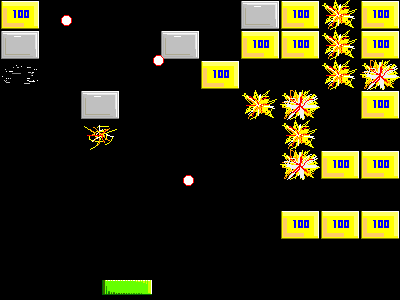



## BreakOut\!

### Description

Yet another clone of the classic game BreakOut... but this one's a little cleverer than most - it has chain reaction explosions, multiple balls to juggle plus fair graphics + sound.
 
### More Info
 
Written in just one day! - So whilst the code is very well structured and easy to read, you may find a bug or two.

             |
---                |---
**Submitted On**   |2000-04-19 21:46:14
**By**             |[Simon Price](https://github.com/Planet-Source-Code/PSCIndex/blob/master/ByAuthor/simon-price.md)
**Level**          |Beginner
**User Rating**    |2.5 (10 globes from 4 users)
**Compatibility**  |VB 5\.0, VB 6\.0
**Category**       |[Games](https://github.com/Planet-Source-Code/PSCIndex/blob/master/ByCategory/games__1-38.md)
**World**          |[Visual Basic](https://github.com/Planet-Source-Code/PSCIndex/blob/master/ByWorld/visual-basic.md)
**Archive File**   |[CODE\_UPLOAD53014282000\.zip](https://github.com/Planet-Source-Code/simon-price-breakout__1-7660/archive/master.zip)

### API Declarations

BitBlt, sndPlaySound

